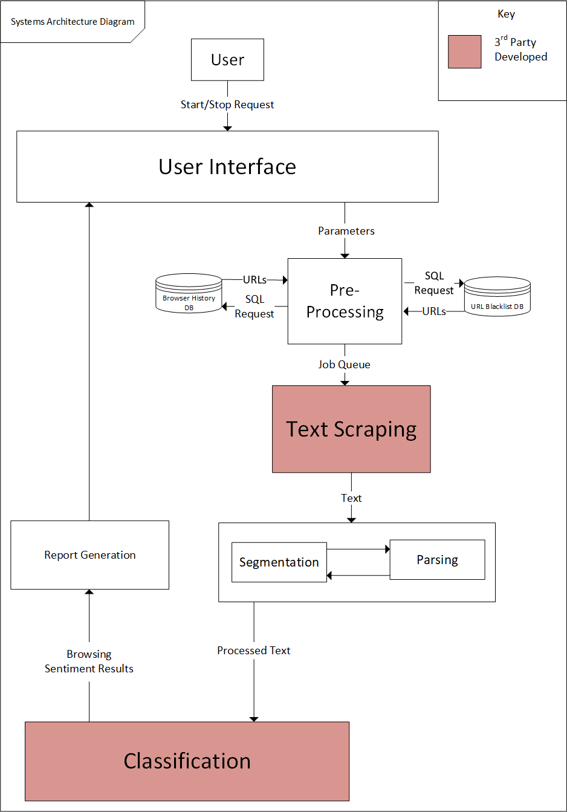
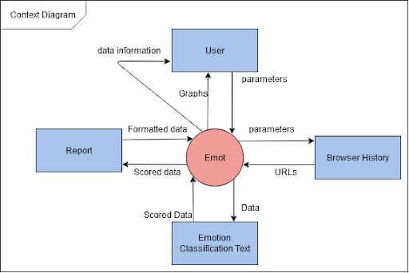
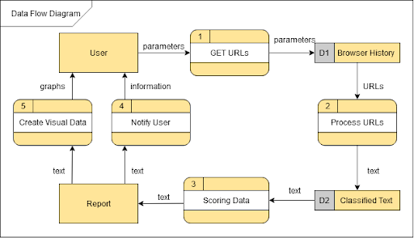
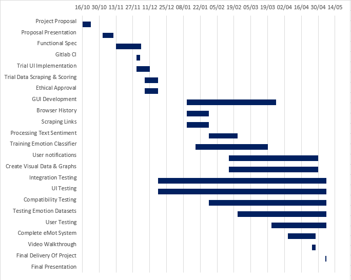

# eMot - Functional Specification
### School of Computing, Dublin City University

### Date: 03/12/2020

### Supervisor: Jennifer Foster

---

### Michael Savage
#### 17313526

### Gerard Slowey
#### 17349433

# Table Of Contents

1. <a href="#1-introduction">Introduction
2
</a>
1.1 - <a href="#11-overview">Overview
2
</a>
1.2 - <a href="#12-business-context">Business Context
2
</a>
1.3 - <a href="#13-glossary">Glossary
3
</a>
2. <a href="#2-general-description">General Description
4
</a>
2.1 - <a href="#21-product-system-functions">Product / System Functions
4
</a>
2.2 - <a href="#22-user-characteristics-and-objectives">User Characteristics and Objectives
4
</a>
2.3 - <a href="#23-operational-scenarios">Operational Scenarios
6
</a>
2.4 - <a href="#24-constraints">Constraints
8
</a>
3. <a href="#3-functional-requirements">Functional Requirements
10
</a>
3.1 - <a href="#31-accessing-browser-history">Accessing Browser History
10
</a>
3.2 - <a href="#32-scraping-links">Scraping Links
10
</a>
3.3 - <a href="#33-processing-the-data">Processing The Data
10
</a>
3.4 - <a href="#34-scoring-data">Scoring Data
10
</a>
3.5 - <a href="#35-notifying-user">Notifying User
10
</a>
3.6 - <a href="#36-creating-visual-data">Creating Visual Data
10
</a>
4. <a href="#4-system-architecture">System Architecture
13
</a>
5. <a href="#5-high-level-design">High-Level Design
15
</a>
5.1 - <a href="#51-context-diagram">Context Diagram
15
</a>
5.2 - <a href="#52-data-flow-diagram">Data Flow Diagram
16
</a>
6. <a href="#6-preliminary-schedule">Preliminary Schedule
17
</a>
6.1 - <a href="#61-gantt-chart">Gantt Chart
17
</a>
7. <a href="#7-appendices">Appendices
18
</a>

## 1. Introduction

### 1.1. Overview
The name of our project is eMot. eMot uses data extraction, natural language processing, emotion classification, and machine learning to judge the sentiment of textual material being read online by a user. eMot is a client-based application, so all private browsing information will be stored locally and not transmitted elsewhere. Incorporating machine learning into the project will allow the system to increase recognition accuracy over time.

eMot provides the user with feedback on the material they have been reading online. The program is designed to specifically interpret the negativity or positivity of the textual material and the most apparent emotions being portrayed in that text. Feedback is then relayed to the user through interactive graphs, with additional informative prompts. The system will also focus on highlighting the material that the user engages with most.

The primary purpose of a program like this is to inform the user about their online browsing habits. With increased rates of working from home, time spent consuming digital media has also increased. If the user is able to monitor the material they read, it may help prevent them from spending too much time focusing on negative online digital media. The program will be designed for all types of users and there will be no need for extra technical training to use the application.

## 1.2 - Business Context
Our system will be suitable for a wide range of demographics, including people of all genders and ages. Users with basic technical knowledge will be able to use the application, due to its intuitive and simple user interface. eMot is designed for regular computer system users who would appreciate monitoring the sentiment of their online browsing. This project will require a descriptive privacy policy and ethics approval due to its sensitive nature.

From our research we are unaware of similar systems with the same goal, and believe that our proposed system presents many advantages. Being aware of certain browsing habits may make the user more aware of their subconscious habits and enable them to make a proactive choice to avoid a certain website or topic if it is deemed to be overly negative.

eMot is designed to be deployable on any relatively modern computer running a Windows, Mac or Linux based operating system. Users of the system can deploy eMot to run in the background on their computer, resulting in an unobtrusive experience. Therefore the general target audience of eMot will be general laptop/ PC users. Cross platform operation will be achieved due to our primary program language Python combined with a cross platform GUI library, such as PYQT.

## 1.3 - Glossary

| Acronym | Definition |
| ------- |  --------  |
| Amazon Web Services (AWS)  | A service that provides on-demand cloud computing platforms and APIs to individuals, companies, and governments, on a metered pay-as-you-go basis.|
| SQLAlchemy | An open-source SQL toolkit and object-relational mapper for the Python programming language released under the MIT License|
| Uniform Resource Locator (URL)  | The address that refers to a web resource.|
| Graphical User Interface (GUI) | A visual way of interacting with a computer using items such as windows, icons, and menus.|
| PYQT | A cross platform Python GUI library. |
| Structured Query Language (SQL) | A language used for relational database management and data manipulation. |
| Unify Datasets | A combined collection of datasets, which have been classified with various emotions from different media streams for emotion classification in text. |
| NLTK | A natural language toolkit for Python, allows for natural language to be processed and analysed. |
| SciKit Learn | A machine learning library for Python, consisting of classification, regression and clustering algorithms. |
| Scrapy | A web crawler and web scraper for Python, mainly used for data extraction.|
--- 

## 2. General Description
### 2.1 - Product / System Functions
The main system functions include:
- Accessing browser history
- Scraping links
- Processing text
- Scoring the text
- Notifying the user 
- Creating visual data

Input will be requested from the user of the system, to select the web browser that they use. Their selection will subsequently affect the browsing history database accessed by eMot. eMot will support chromium based browsers (e.g. Google Chrome, Brave, Edge) and Firefox. This will enable the sentiment analysis component of the system to function by scraping text from URLs contained within the browsing history SQL database.

**Training the Emotional Classifier Model**

A classifier model will be trained on the cloud, using relevant and adequately labelled data sets for emotional classification. These models will then be stored on the local machine and used for emotional classification of user input.

Individual pages will be scored based on their textual content, with each individual web page contributing to a collective sentiment score. Certain filtering rules will be applied when accessing the user’s URLs database to ensure that eMot doesn’t waste resources on repeated processing of duplicate sites and sites that were only briefly accessed.
The user will have the option to blacklist certain websites also. These sites will not be considered when analysing browsing sentiment. The user may want to exclude certain sites such as email, etc.
Based on the browsing habits of the user, the application will show a graphical user interface summarising and indicating to the user the sentiment of the material they have been focusing on. 

### 2.2 - User Characteristics and Objectives
The users of this program will not need extra technical training. A functional front end graphical interface will be presented to the user which allows them to start and stop the sentiment system. This will help to abstract from the underlying technology, preventing confusion. The user interface will also be used to present graphical feedback to the user about the sentiment of the text they are reading, which they can interact with to learn more.

Objectives of the system will include providing an intuitive and easy to understand interface. The user interface will summarise and highlight the sentiment of primary textual material focused on. This is an active area of research in Natural Language Processing and we want to give the user helpful indicators. Text scraping and emotion classification should be quick and even incorporating a simple keyword-based system would provide a sufficient level of accuracy for providing indicators to the user.

**Wishlist:**
- Realtime text extraction from sites currently being viewed.
- 80 to 90% emotion classification accuracy. [2] [3]
- Real time user prompting and graphical representation.

**More Feasible:**
- Processing of text on pages read after leaving the web page, depending on the 
- efficiency of text scraping, parsing and scoring.
- 70 to 80% emotion detection accuracy
- Accurate depiction of main emotions within text focused on by the user.
- Accessible, intuitive user interface.

**User Stories**

|  | Story | System Expectations |
| ----- | ----- | ------------------- |
| Name: Liam   Age: 70   Occupation: Retired   Technical Skills: Basic |Liam is curious to see what sort of articles and online material he is consuming. | Liam has a better understanding of the content he is viewing and makes an effort to stay away from negatively skewed articles. |
| Name: Hannah   Age: 20   Occupation: Student   Technical Skills: Intermediate | Hannah is a DCU student who is very aware of the impact of social media and wants to confirm that many social media posts can be portrayed in a negative way. | Hannah wants to see how negative the content she is viewing and make a reactive decision. |
| Name: Jessica   Age: 34   Occupation: Nurse   Technical Skills: Advanced | Jessica is a Nurse, she mainly reads health articles which she uses to advise her patients. | Jessica is curious to see what emotional context is linked to the different types of health articles she reads. |

### 2.3 - Operational Scenarios
| Use Case 1 | User installs the application on their PC. |
| ---------- | ------------------------------------------ |
|Preconditions | User has a working internet connection.  |
| Success End Condition | The application is installed and ready to be used. |
| Failed End Condition | The application encounters an error when installing. |
| Actors | User, System. |
| Trigger | User runs the application installer on their system. |
| Description | 1. Start downloading the application using an internet connection.   2. Check Python is installed and up to date.   3. Download datasets.   4. Inform the user that the application is installed successfully. |
| Extension | 1a. PC cannot connect to the internet. Notify User and retry.   2a. Python is not installed. Install Python to the latest version. |

| Use Case 2 | Display graph of scored data. |
| ---------- | ------------------------------------------ |
|Preconditions | Application is installed successfully.  |
| Success End Condition | User can read and understand visual data on a graph. |
| Failed End Condition | User cannot interpret the data. |
| Actors | User, System. |
| Trigger | User clicks on the ‘Start System’ button. |
| Description | 1. User parameters are sent to the pre-processing engine.   SQLite Database URLs are scraped.   Scraped data is processed and scored.   The data is represented on a comprehensible graph.|
| Extension | 3a. The data is null and the graph cannot be compiled.   3a. Python is not installed. Install Python to the latest version. |

| Use Case 3 | User checks their graphical score. |
| ---------- | ---------------------------------- |
| Preconditions | Application is installed successfully. |
| Success End Condition | User is notified about their online browsing habits. |
| Failed End Condition | User fails to interact with the graphical bar. |
| Actors | User, System. |
| Trigger | Data is processed and scored. |
| Description | 1. Individual web pages are scored and added to a collection of other scored pages.   2. The score is updated to reflect the overall sentiment of the text collection.   3. The program GUI uses coloured graphs representing negativity and positivity.   4. User is presented with a graphical view of the scored data. |
| Extension | 3a. User cannot tell the difference between the colours used. The User changes the colours.   3a. User does not see the generated graphs. |

| Use Case 4 | User blacklists a site. |
| ---------- | ---------------------------------- |
| Preconditions | Application is installed successfully. |
| Success End Condition | User adds a specific URL to a blacklist, which the program will ignore when running sentiment analysis. |
| Failed End Condition | Users preferences are not taken into account. |
| Actors | User, System. |
| Trigger | User updates preferences. |
| Description | 1. User clicks on the user preferences.   2. User adds a website to the blacklist.   3. User clicks save and the website is added to the blacklist. |
| Extension | 3a. Website is not saved to a blacklist database. |

### 2.4 - Constraints
The following are a list of possible constraints that can cause some limitations to the system functions. If time constraints are not an issue we must then be aware of:

- *SQLite database location*: Some users may have to install browsers onto external hard drives and or may have installed their browsers in unusual places. We need to try to cater for people who have specific installations. This would be more of a problem for Windows machines.

- *Sequential database access*: Accessing the browser history database at the same time as a browser may pose some problems. If the users browser is open, eMot may be locked from accessing the database, preventing it from functioning properly.

- *Internet Access*: If no stable internet connection is available the text scraper of the system will not be able to access URLs and complete the subsequent steps.

- *Installing Python*: This application needs Python3 installed. It may not work as intended if deprecated versions are installed.

- *Retrieving Information Error*: If the user spends a lot of time on websites like Facebook, there could be an issue with scraping as Facebook might block the application’s IP address.

- *Processing Power*: if our program running in the background consumes the majority of the systems computing power when scraping and classifying text this will lead to a poor user experience and likely cause the user to uninstall the program. The system will therefore need to be kept efficient with the classifier model being compact for systems with less storage capacity.

- *System Performance Efficiency*: The eMot application must be able to quickly scrape and process sites and text being viewed by the user. Delivering sentiment results to the user a few days later may not be beneficial.

- *Privacy Statement*: If the user does not accept this on the first usage, they will not be able to use the application.

- *Graphical Representation*: scaling the application graphical representation to fit different sizes of displays, e.g. 13” screen and 15” screen. The use of the PYQT framework will be necessary to achieve this.

- *Scoring Accuracy*: Classifying the emotions needs to be  as accurate as possible and straightforward to understand. This accuracy could be reduced due to strange sentence structures being interpreted wrong. If training sets are not appropriately relevant, scoring will be skewed. 
  - Examples using tweets and hashtags: [4]

        1. You are really mature. #lying #sarcasm
        2. I am not happy that I woke up at 5:15 this morning.. #greatstart #sarcasm
        3. It’s not like I wanted to eat breakfast anyway. #sarcasm
        4. I love living with a 7 year old #NotReally #sarcasm

- *AWS availability*: Our emotional classification will be trained on the cloud. If the models are not available client-side due to connectivity issues, then scoring of text will not be possible. Another constraint on the system will be the type of algorithm used, AWS provides a certain cap on time and memory constraints when training and running the model, before incurring fees. Therefore a complex deep learning architecture would not be feasible.

## 3. Functional Requirements

### 3.1 - Accessing Browser History
| Requirement ID |  1  |
| -------------- | --- |
| Description | The application must be able to find the directory where the browser’s history database is stored. This is different to each operating system and different to every browser. |
| Criticality | This is the most critical step, without the URLs to scrape and analyse, the system would not be able to achieve its goal of scoring data. |
| Dependencies | Only when the history is retrieved, can requirement ID 2 be initiated. |
| Technical Issues | Being unable to access history on Windows, Linux, and Mac machines using Chrome and Firefox. |

### 3.2 - Scraping Links
| Requirement ID |  2  |
| -------------- | --- |
| Description | The application must be able to go through the individual links from the retrieved history and scrape the data.  |
| Criticality | Very critical in proceeding with requirement 3. By filtering out sites that the user briefly visits, we can focus our attention on the main sites visited by the user. |
| Dependencies |  Scraping links closely links to Requirement ID 1. |
| Technical Issues | If websites can not be scraped, a fix must be discussed or the links will have to be bypassed.  |

### 3.3 - Processing The Data
| Requirement ID |  3  |
| -------------- | --- |
| Description | The application must be able to classify the emotions of the extracted data. For this we will use classifiers that we have trained on the cloud, with the training model stored locally on the users system. This involves processing the stemming and tokenization of words and running it on the local machine. |
| Criticality | We need this to be considerably accurate so that the score will be useful for the user. |
| Dependencies | Depends on Requirement ID 2 returning meaningful scraped data and  acts as input to Requirement ID 4. |
| Technical Issues | If websites can not be scraped, the links will have to be bypassed or tried again later. |

### 3.4 - Scoring Data
| Requirement ID |  4  |
| -------------- | --- |
| Description | The system must be able to score the classified data. This will represent negativity or positivity of the topics. |
| Criticality | This is critical and needs to be given substantial thought so that the system is useful. |
| Dependencies | This depends on Requirement ID 3 returning meaningful data. |
| Technical Issues | If scores are neutral all the time, users need to be aware of this. |

### 3.5 - Notifying User
| Requirement ID |  5  |
| -------------- | --- |
| Description | The user should be notified of their browsing sentiment, whenever a set threshold of negative text has been read the user will be notified with a popup message box reminding them to take a break. |
| Criticality | Low priority, not immediately related to the function of the program. Mainly a benefit to the user and based on the main program function of running sentiment on text. |
| Dependencies | This function is dependent on requirement ID 4, the scored data will be calculated according to the negativity threshold. |
| Technical Issues | Forcing a user prompt which may be ignored or missed by the user when interacting with a different program window. |

### 3.6 - Creating Visual Data
| Requirement ID |  6  |
| -------------- | --- |
| Description | A graphical representation of the content viewed in the form of charts, for example progress bars. Customisable colours will be used to distinguish between negative and positive sentiments. |
| Criticality | This function is intended for ease of use of the system by the user. It is of low priority to the use of the system. |
| Dependencies | The visuals depend on the data from Requirement ID 4. |
| Technical Issues | If the user cannot make sense of the visual, they should be able to understand the scores in another way. |

## 4. System Architecture

### System Architecture Description

**Boxes in Red**

This is a third party component implemented using a Python library. Any third party components used will use a ‘white box’ approach where we understand the internal workings, necessary inputs and expected outputs.

**User Interface**

The user of the system indicates using options presented on the application user interface, the internet browser they are using and the option to start and stop the sentiment system. These parameters determine the directory used by the pre-processing engine when accessing the users browser history database. 

**Pre-processing Engine**

The pre-processing function will be responsible for accepting parameters from the front end GUI. These parameters include web browser choice, and start/stop requests. By default chrome and firefox based web browsers use SQLite databases for browsing history storage. The Python library SQLAlchemy will be used for SQL database access and data manipulation. The pre-processing function will then form a queue of URLs to be scrapped, featuring first in, first out (FIFO) data access. This will likely be implemented using a set to remove duplicate URLs. The users blacklist database will also be checked to ensure a URL that is blacklisted is not added to the queue.

**Text Scraping**

The sole responsibility of the text scraper is to access supplied URLs, scrap text from these sites while removing HTML content. The scraping queue formed by the pre-processing function feeds URLs to the text scraper. The resulting text scraped is forwarded to a text processing function which formats the text for the classification engine. 

**Text Processing**

The text processing of the system involves segmentation and parsing of scraped text for efficient sentiment analysis.

**Emotion Classification**

Emotion classification and sentiment analysis is then completed on the processed text which then produces a sentiment result which is fed to a report generation function. 

**Report Generation**

The report generation function takes the result from a scraping and classification batch and prepares to display that through the user interface for user interaction and analysis.

## 5. High-Level Design
### 5.1 - Context Diagram

This diagram shows the relationship between the eMot system, in red, and the external entities, in blue.

**1. User**
- The user will pass parameters to the system when initiating a search. These parameters will include the specified time period among other things. 
- The system will return the graphical results after processing and scoring the links.

**2. Browser History**
- The SQLite database contains all the browser history. The system will send a request using the parameters to the database to specify the URLs wanted.
- The system will get this information in the time period provided and will return the URL to the system.

**3. Emotion Classification Text**
- After the eMot system scrapes the URLs in the queue, it will use the trained datasets from the cloud to score the data. 
- The emotion classification will score the data and return it to the system. This will return a better score over time with the machine learning element.

**4. Report**
- Now that the system has the scored data, it must format it and present it to the user. It first sends it to a report so that graphs can be made and the data can be used in a graphical representation.

### 5.2 - Data Flow Diagram

Using the context diagram, we can represent the flow of data between the different entities in the eMot system. The rectangles represent entities, the rounded rectangles with numbers represent functions, and the rectangles with grey IDs represent datastores.

**Function 1:**

The User entity starts the program by inputting parameters that will get certain URLs from the browser history (D1). 

**Function 2:**

The browser history URLs will point to the websites that need to be scraped. These URLs will be processed. 

**Datastore 2:**

The scraped and processed data will then be analysed by the trained emotion classification on the cloud. The datasets will be used in this to score the sentiment of the text on the local machine.

**Function 3:**

From the emotion classification, the data can be scored based on positive or negative emotions.

**Report Entity:**

The scored data will then be interpreted for the User as a progress bar and a graph.

## 6. Preliminary Schedule
### 6.1 - Gantt Chart
The preliminary schedule will consist initially of developing the core system requirements; which are database access and manipulation, text processing and basic sentiment analysis. We hope to have a minimal viable product by mid to late December, before preparation begins for January exams.

After January exams are completed, we hope to start work on the front end, in order to begin interaction testing. After this sentiment analysis will be expanded by training an emotion classifier using supplied datasets.

Unit tests will be completed right throughout the development stages.

Technical documentation will be completed throughout the entire span of development also, being gradually updated after each deliverable is achieved. The final few weeks before project completion will be dedicated to bug fixes and user manual development.

## 7. Appendices

[1] Dhar, S., Guo, J., Liu, J., Tripathi, S., Kurup, U. and Shah, M., 2020. *On-Device Machine Learning: An Algorithms And Learning Theory Perspective.* [online] arXiv.org. Available at: <https://arxiv.org/abs/1911.00623> [Accessed 30 November 2020].

[2] Liu, J., Wu, G., Luo, Y., Qiu, S., Yang, S., Li, W. and Bi, Y., 2020. *EEG-Based Emotion Classification Using A Deep Neural Network And Sparse Autoencoder.* [online] frontiersin.org. Available at: <https://www.frontiersin.org/articles/10.3389/fnsys.2020.00043/full> [Accessed 28 November 2020].

[3] Hassouneh, A., Murugappan, M. and Mutawa, A.M., 2020. *Development Of A Real-Time Emotion Recognition System Using Facial Expressions And EEG Based On Machine Learning And Deep Neural Network Methods.* [online] sciencedirect. Available at: <https://www.sciencedirect.com/science/article/pii/S235291482030201X> [Accessed 26 November 2020].

[4] Maynard, D. and Greenwood, M., 2014. *Who Cares About Sarcastic Tweets? Investigating The Impact Of Sarcasm On Sentiment Analysis - White Rose Research Online.* [online] Eprints.whiterose.ac.uk. Available at: <http://eprints.whiterose.ac.uk/130763/> [Accessed 27 November 2020].
